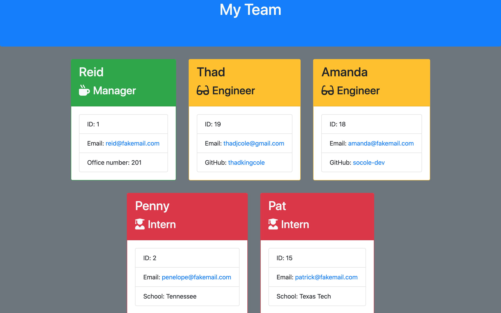

# Team Profile Generator

[](https://app.codacy.com/manual/thadkingcole/team_profile_generator?utm_source=github.com&utm_medium=referral&utm_content=thadkingcole/team_profile_generator&utm_campaign=Badge_Grade_Dashboard)

[](LICENSE)
[](code_of_conduct.md)

A console app that generates a webpage with the team's basic info.


## Table of Contents

- [Installation](#installation)
- [Usage](#usage)
- [Contributing](#contributing)
- [Tests](#tests)
- [Questions](#questions)
- [Credits](#credits)
- [License](#license)

## Installation

First, clone this repository using your preferred method, either SSH:

```git
git clone git@github.com:thadkingcole/team_profile_generator.git
```
or HTTPS:
```git
git clone https://github.com/thadkingcole/team_profile_generator.git
```

Once the repo is cloned, navigate into its root directory and run "npm i" to install the app.

```console
cd team_profile_generator
npm i
```


[back to Table of Contents](#table-of-contents)

## Usage

See [demo video](https://drive.google.com/file/d/1wS6J5vcDSe257hCi_fhgcXvlDJToY5LT/view), or follow the following instructions.

Using your preferred console, navigate to the root directory of the repo where you want markdown files generated. Then enter ```node app.js```

```console
node app.js
```

Follow and answer the prompts as they appear on screen.

You'll first be asked to provide information about the team's manager. After that, you'll be asked if you want to add another member. Each time you answer yes, you will be able to add either an engineer or an intern. Once you have added all the desired team members, simply answer no when asked to add another member.

The webpage with your team's information will be output in the output folder titled team.html The file is ignored by git, so you don't have to worry about your team's information being added to the repository.

```console
./output/team.html
```

Your webpage will look something like this.




[back to Table of Contents](#table-of-contents)

## Contributing

Your contribution is most welcome! Please refer to the contributing guidelines when making contributions to this project.

Please note that this project is released with a [Contributor Code of Conduct](code_of_conduct.md). By Participating in this project, you agree to abide by its terms.

[back to Table of Contents](#table-of-contents)

## Tests

Several modules were written to support this app, and they can all be tested by running `npm test` in the root directory of this repository.

```console
npm test
```

[back to Table of Contents](#table-of-contents)

## Questions

Please direct any and all questions to [thadkingcole](https://github.com/thadkingcole) or via email at [thadjcole@gmail.com](mailto:thadjcole@gmail.com).

[back to Table of Contents](#table-of-contents)

## Credits

I would like to thank the following people/projects/organizaitons:

- [inquirer.js](https://github.com/SBoudrias/Inquirer.js) for easy console prompts
- [w3resource](https://w3resource.com/) for [email validation with regex](https://www.w3resource.com/javascript/form/email-validation.php)

[back to Table of Contents](#table-of-contents)

## License

[MIT](LICENSE) copyright (c) 2020 [Thaddeus Cole](mailto:thadjcole@gmail.com).

[back to Table of Contents](#table-of-contents)
